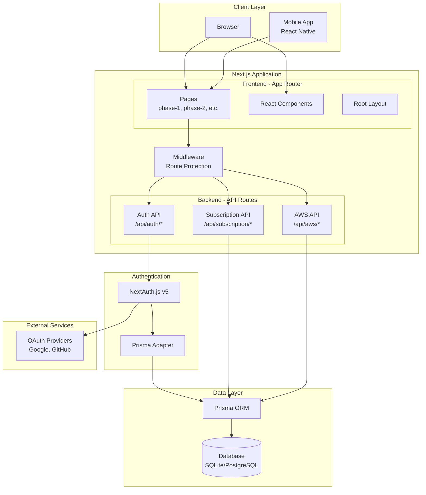
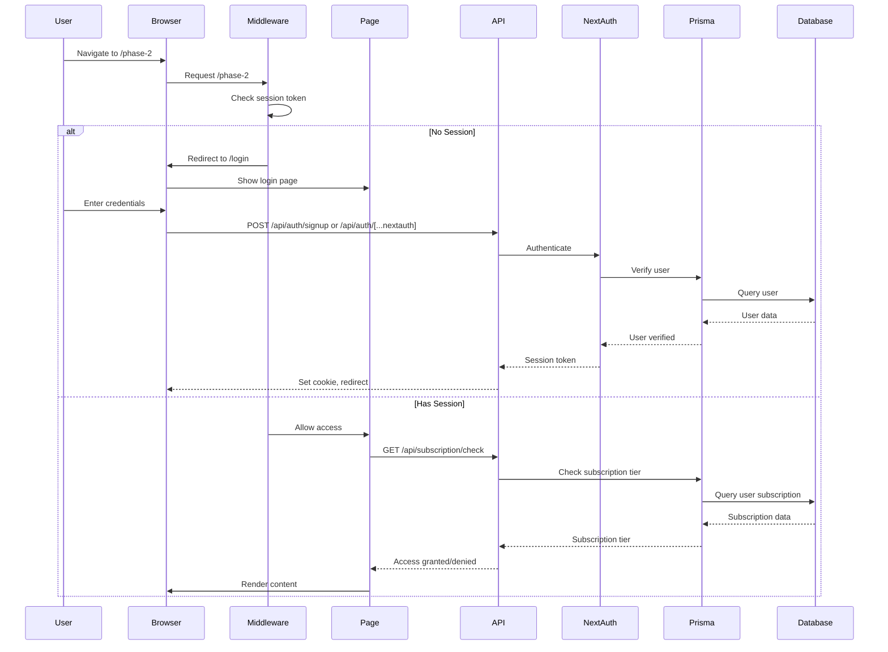
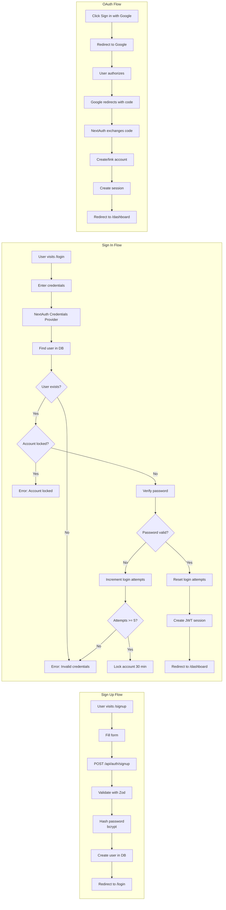
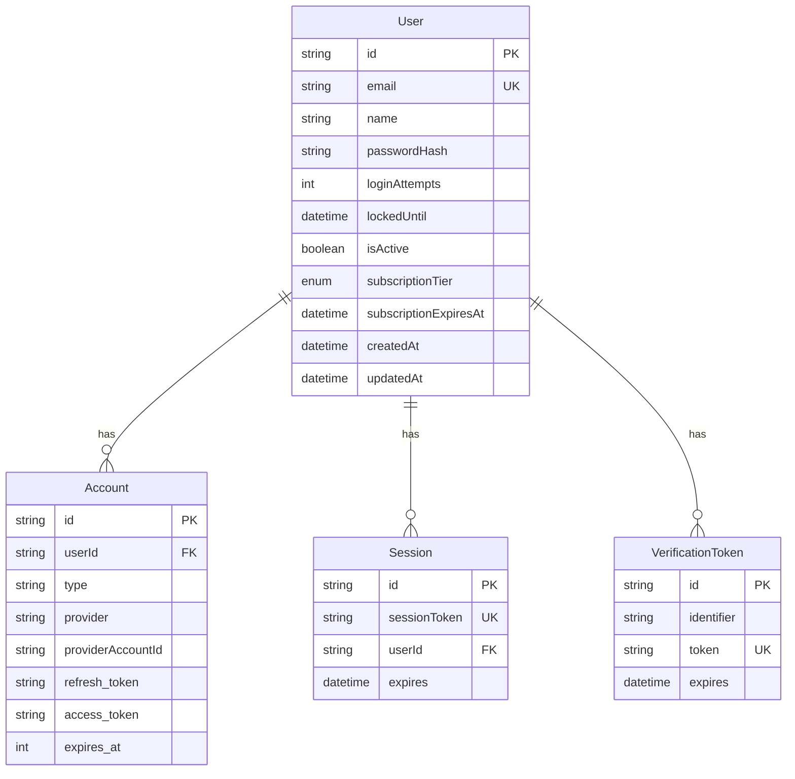
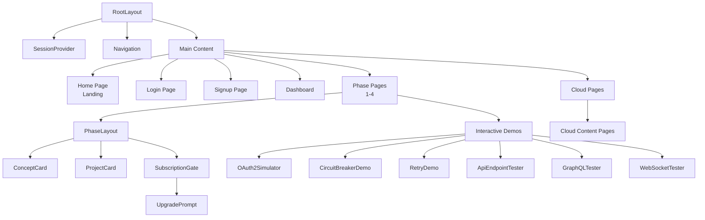
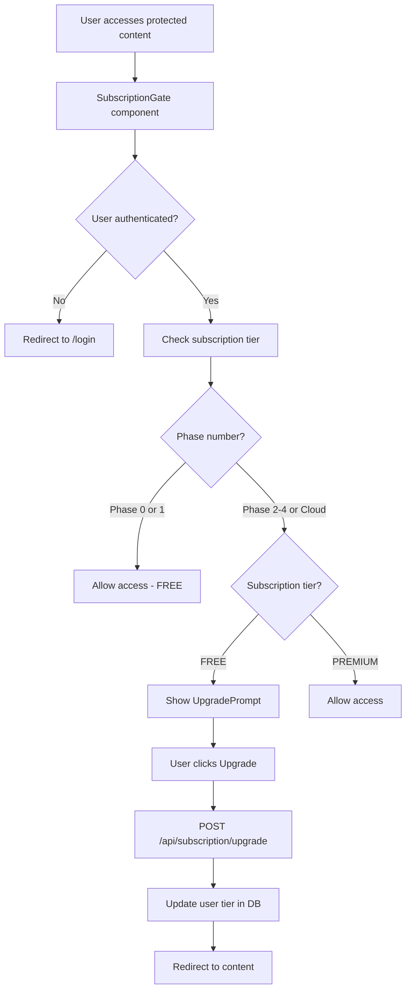
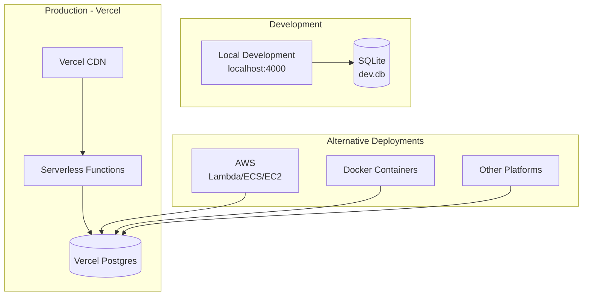
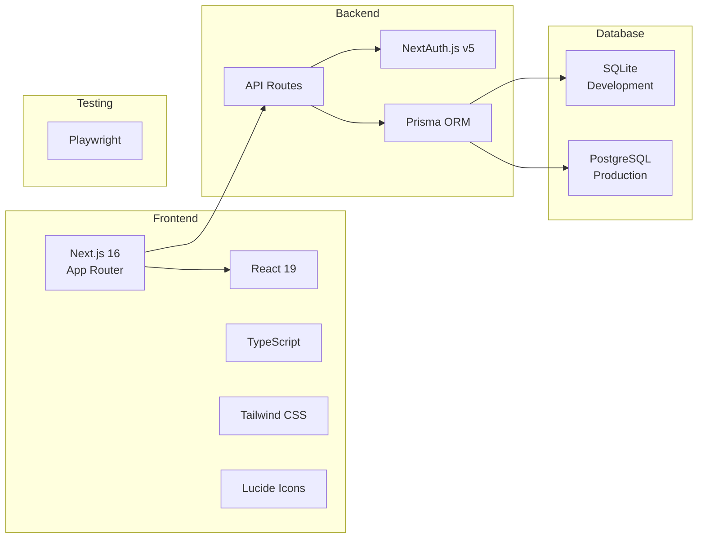
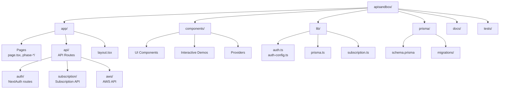

# API Integration Training Platform - Architecture Documentation

## Overview

This document describes the architecture of the API Integration Training Platform, a Next.js-based educational application for teaching API integration patterns.

## System Architecture



## Request Flow



## Authentication Flow



## Database Schema



## Component Structure



## Subscription System Flow



## Deployment Architecture



## Technology Stack



## File Structure



## Key Architectural Decisions

### 1. **Full-Stack Next.js**
- **Decision**: Use Next.js App Router for both frontend and backend
- **Rationale**: Simplifies deployment, reduces complexity, ideal for educational content with some interactive features
- **Trade-off**: Less separation of concerns, but acceptable for this use case

### 2. **NextAuth.js v5**
- **Decision**: Use NextAuth.js for authentication
- **Rationale**: Industry-standard, handles OAuth, sessions, and security best practices
- **Trade-off**: Learning curve, but provides robust auth out of the box

### 3. **Prisma ORM**
- **Decision**: Use Prisma with SQLite (dev) and PostgreSQL (prod)
- **Rationale**: Type-safe queries, easy database switching, great DX
- **Trade-off**: Migration overhead, but worth it for type safety

### 4. **Freemium Model**
- **Decision**: Implement subscription tiers (FREE/PREMIUM)
- **Rationale**: Allows free access to Phase 1, monetizes advanced content
- **Trade-off**: Adds complexity, but enables sustainable business model

### 5. **Client-Side Components**
- **Decision**: Use "use client" for interactive features
- **Rationale**: Needed for hooks, state management, and interactivity
- **Trade-off**: Larger bundle size, but necessary for demos

## Security Architecture

```mermaid
graph TB
    subgraph "Security Layers"
        Middleware[Middleware<br/>Route Protection]
        NextAuth[NextAuth<br/>Session Management]
        RateLimit[Rate Limiting<br/>In-memory/Redis]
        PasswordHash[Password Hashing<br/>bcrypt 12 rounds]
        AccountLock[Account Lockout<br/>5 failed attempts]
    end
    
    subgraph "Protected Routes"
        Dashboard[/dashboard]
        Phases[/phase-*]
        Cloud[/cloud]
    end
    
    subgraph "Public Routes"
        Home[/]
        Login[/login]
        Signup[/signup]
    end
    
    Middleware --> Dashboard
    Middleware --> Phases
    Middleware --> Cloud
    NextAuth --> Middleware
    RateLimit --> NextAuth
    PasswordHash --> NextAuth
    AccountLock --> NextAuth
```

## Performance Considerations

1. **Static Generation**: Content pages (phases) can be statically generated
2. **API Routes**: Serverless functions scale automatically on Vercel
3. **Database**: Connection pooling via Prisma
4. **Caching**: Next.js automatic caching for static content
5. **Code Splitting**: Automatic via Next.js App Router

## Future Enhancements

- [ ] Add Redis for production rate limiting
- [ ] Implement email verification
- [ ] Add password reset flow
- [ ] Implement 2FA/MFA
- [ ] Add analytics tracking
- [ ] Implement search functionality
- [ ] Add progress tracking
- [ ] Implement certificate generation
